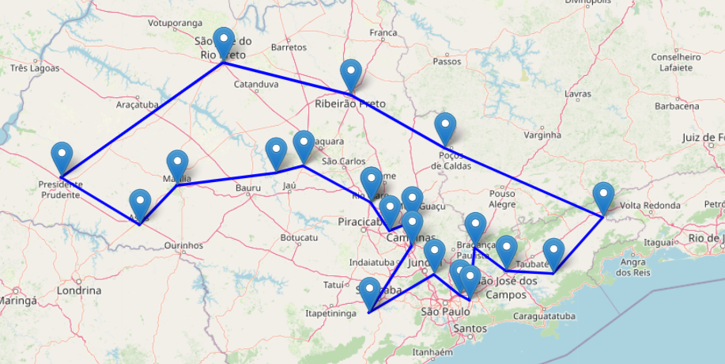

# Travel-Salesman-Problem (TSP)
Given a set of cities and the distances between each pair of cities, the goal is to find the shortest route that allows the traveling salesman to visit each city exactly once and return to the starting city.

# Intro
Find the best route, starting from the capital and returning to it at the end without repeating cities.

1. Find the best route capable of solving at least 20 cities.

2. Adapt item 1 to perform vehicle routing.

3. Scale the solution from item 1 to include all the cities in the state of Sao Paulo, Brazil.

# Methods

**Ant Colony Optmization** 

- Metaheuristic technique inspired by the behavior of ants searching for food.
  
- It is an approach based on the concept that ants can find the shortest path between their colonies and a food source through indirect communication measured by pheromones.

**Algorithm 2-OPT**

- Reduces the total distance traveled bvy a traveling salesman by eliminating unnecessary crossing in a path, resulting in a shorter and more efficient route.
